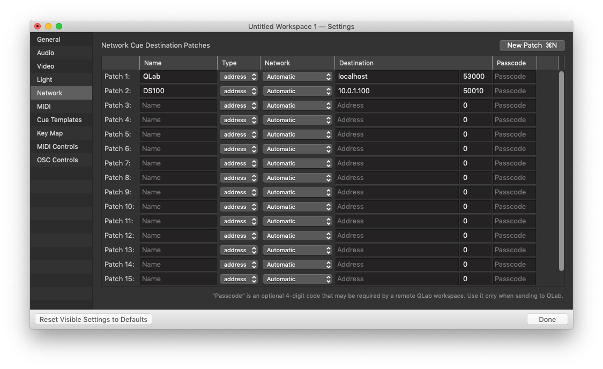

# fakeDS100

An OSC utility for mimicking some d&amp;b audiotechnik DS100 OSC replies

---

## Initial Setup

### Your QLab workspace

You may have a QLab workspace already built, with a network patch addressed to your DS100. Maybe something like this:



Change the address of your DS100 Network patch (Patch #2 in the example) to localhost. The port number should remain at 50010.

---

### config.json

Change details in the `config.json` file if necessary. Make sure to separate key-value pairs with a comma, and wrap all keys in double quotes.

As of this writing (Sept 17, 2020) DS100 and QLab port numbers are fixed by their respective creators and should not require changes here.

DS100.defaultMapping does not currently serve a purpose, added for future funcionality.

```json
{
  "QLab": {
    "Port": "53000",
    "Address": "localhost"
  },
  "DS100": {
    "Port": "50010",
    "Reply": "50011",
    "Address": "localhost",
    "defaultMapping": "1"
  }
}
```

### objects.json

Edit, add, or remove your DS100 En-Scene objects here.

Each object has a **num** property which corresponds to its DS100 input number.

The **name** property does not currently serve a purpose, added for future functionality and easier management of the file.

```json
{
  "objects": [
    {
      "num": 1,
      "name": "Homer",
      "x": 0.0,
      "y": 0.0
    },
    {
      "num": 2,
      "name": "Marge",
      "x": 0.0,
      "y": 0.0
    },
    
    ...

  ]
}
```

---

## Running the app

Assuming you have node.js installed:

Open a terminal window, `cd` into the fakeds100 repository, and enter `node app.js` to start the program.

To stop, end the terminal session or press ⌃C on your keyboard.

### Initial State

Upon running the app, a cache of current object positions is initialized from the `objects.json` file. Objects must be present in this file in order to work with fakeds100. For example, sending a query for the current position of En-Scene object #5 will not work is there is not a `{ "num": "5" }` object in `objects.json`.


---

## OSC Commands

fakeds100 responds to a very limited set of the commands that a real DS100 would respond to. The full OSC library for a real DS100 can be found on d&b's [DS100 Downloads page](https://www.dbaudio.com/global/en/products/processing-matrix/ds100/#tab-downloads).

The limited set of commands that fakeds100 will respond to are documented here:


### /fakeds100/randomize

```
/fakeds100/randomize
```

Updates x and y coordinates of each object in the cache to a random number between 0 and 1, then sends the new cached coordinates of the object (with the default mapping)

---
### /dbaudio1/coordinatemapping...

```
/dbaudio1/coordinatemapping/source_position_x/[mapping]/[object] [x]
```
If an argument is provided, updates cached x coordinate, then sends cached x and y coordinates.

```
/dbaudio1/coordinatemapping/source_position_y/[mapping]/[object] [y]
```
If an argument is provided, updates cached y coordinate, then sends cached x and y coordinates.

```
/dbaudio1/coordinatemapping/source_position_xy/[mapping]/[object] [x] [y]
```
If arguments are provided, updates cached x and y coordinates, then sends cached x and y coordinates.

---
## That's it

That's all for now. Hopefully more to come sometime. You can watch this GitHub repo for future updates or [send me an email](mailto:samsdomainaddress@gmail.com).